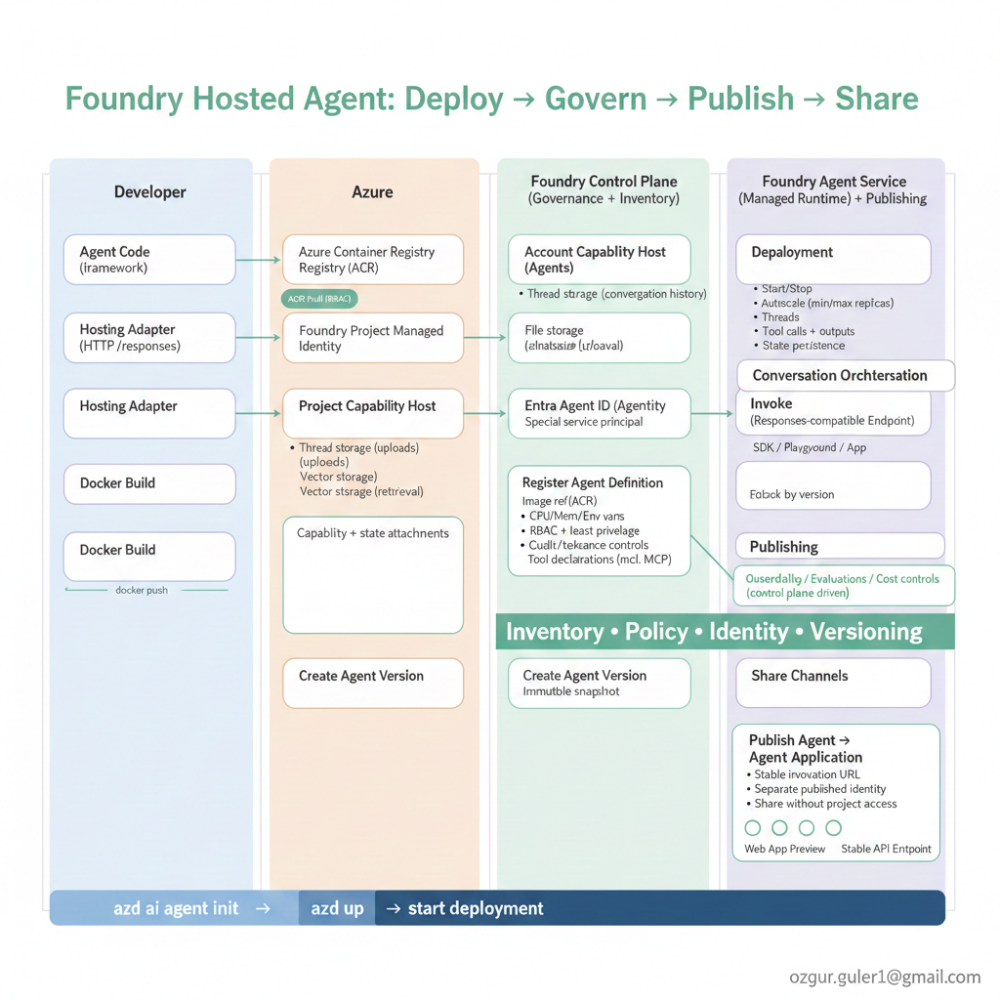

# 02 — Deploy as a Foundry Hosted Agent (azd)

## Goal
Deploy the agent as a Foundry hosted agent using `azd` so it runs as a managed service.

## Architecture



The diagram shows the complete lifecycle: **Deploy → Govern → Publish → Share** — from developer code through Azure infrastructure to the Foundry control plane and agent service.

## You will end with
- Infrastructure provisioned via `azd`
- Agent published as a hosted agent in Foundry
- A working endpoint you can call

## Prerequisites
- Completed `../06-tool-calling-and-otel`

## Proof (checklist)
- [ ] `azd up` completes successfully
- [ ] Hosted agent is visible in Foundry
- [ ] Endpoint invocation works and is traceable

## Deployment Methodology

The deployment uses **Azure Developer CLI (azd)** with the **AI agent extension**:

```
azd deploy
    ↓
1. Reads azure.yaml → finds service "agent-lzooao" pointing to src/my-hosted-agent
    ↓
2. Builds Docker image from src/my-hosted-agent/Dockerfile
    ↓
3. Pushes image to ACR (aicontainervault01.azurecr.io)
    ↓
4. Reads src/my-hosted-agent/agent.yaml for agent definition (name, protocols, env vars)
    ↓
5. Creates hosted agent version in Azure AI Foundry via API
    ↓
6. Starts the container (waits for "Running" status)
```

The container runs `python main.py` which calls `from_agent_framework(agent).run()` - this starts an HTTP server on port 8088 that exposes the `/responses` endpoint.

## Next
Continue to `../08-entra-agent-id-conditional-access`.

---

**Author:** Ozgur Guler | AI Solution Leader, AI Innovation Hub | [ozgur.guler1@gmail.com](mailto:ozgur.guler1@gmail.com)
© 2025 Ozgur Guler. All rights reserved.

