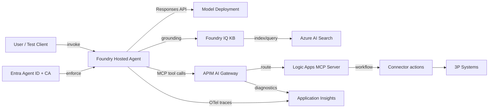

# Azure AI Foundry — Ignite 2025 Demo (End-to-End, Proof-Driven)

[-111827)](#)

This repo is a hands-on demo that showcases the most important **new capabilities announced at Microsoft Ignite 2025** for building, running, and governing AI agents with **Azure AI Foundry**—with an emphasis on **enterprise-proof** outcomes: identity enforcement, traceability, knowledge grounding, tool governance, and workflow automation.

## Contents

- [What this demo proves](#what-this-demo-proves-not-just-shows)
- [End-to-end demo flow](#end-to-end-demo-flow-with-proof-points)
- [Workshop structure](#workshop-structure)
- [Architecture](#architecture-conceptual)
- [Prerequisites](#prerequisites)
- [Repo layout](#repo-layout)

## What this demo proves (not just “shows”)

- **Hosted agents** on Foundry (Agent PaaS): deploy and run your custom agent as a managed service.
- **Microsoft Agent Framework** tool calling, plus **OpenTelemetry** end-to-end traces with a stable `gen_ai.agent.id`.
- **Entra Agent ID + Conditional Access (Preview)** enforcement: demonstrably allow/deny agent access.
- **Observability** across Foundry tracing and **Application Insights “Agents view”** (latency, failures, tokens/cost).
- **Foundry IQ grounding** backed by **Azure AI Search**: retrieval spans in traces + citations in responses.
- **MCP tooling via Logic Apps Standard** as a **remote MCP server** (workflows exposed as tools).
- **Logic Apps connectors** to third-party systems (Slack/Jira/Salesforce/ServiceNow/etc.) triggered via MCP tools.
- **API Management AI Gateway** in front of MCP for **enterprise-safe tool traffic** (rate limits + injection guardrails + logs).
- **Foundry control plane integration**: register tools (and optionally agents) so they show up in Foundry’s catalogs and configs.
- **Logic Apps invoking the agent** (Agent Service connector / trigger patterns) to complete a governed, observable chain.

## End-to-end demo flow (with proof points)

This repo is organized as a step-by-step workshop. Each step is a folder, and you only advance once the “Proof” checklist is green.

1. **Pre-req plumbing (so later steps are real)**
   - Foundry project + model deployment + tracing and governance backends
   - ✅ Proof: resources exist and are wired correctly
2. **Build + instrument the agent**
   - Agent Framework + deterministic tool call + OpenTelemetry + stable `gen_ai.agent.id`
   - ✅ Proof: local runs emit trace spans including tool calls and failures
3. **Host + govern**
   - Deploy as a Foundry hosted agent with `azd`; enforce Entra Agent ID Conditional Access (Preview)
   - ✅ Proof: hosted agent is visible/working; CA allows/blocks measurably in Entra logs
4. **Grounding + enterprise-safe tools**
   - Foundry IQ retrieval backed by Azure AI Search; Logic Apps MCP server + 3P connectors; APIM AI Gateway policies
   - ✅ Proof: retrieval spans + citations; APIM rate-limit + injection guardrails + logs

## Workshop structure

| Step | Folder | Outcome |
| --- | --- | --- |
| 00 | `00-environment-setup/` | Local tooling + env ready |
| 01 | `01-foundry-project-and-model-deployment/` | Foundry project + model deployment |
| 02 | `02-application-insights-tracing/` | App Insights attached (tracing enabled) |
| 03 | `03-apim-ai-gateway/` | APIM + AI Gateway for governance |
| 04 | `04-azure-ai-search-and-foundry-iq/` | Azure AI Search + Foundry IQ KB |
| 05 | `05-agent-build-with-agent-framework/` | Minimal agent runs locally |
| 06 | `06-tool-calling-and-otel/` | Deterministic tool + OTel + `gen_ai.agent.id` |
| 07 | `07-azd-deploy-hosted-agent/` | Hosted agent deployed with `azd` |
| 08 | `08-entra-agent-id-conditional-access/` | CA enforcement proof |
| 09 | `09-observability-proof/` | Foundry + App Insights “Agents view” proof |
| 10 | `10-iq-grounding-proof/` | Retrieval + citations + spans proof |
| 11 | `11-logic-apps-mcp-server/` | Logic Apps Standard as MCP server |
| 12 | `12-logic-apps-connectors-as-mcp-tools/` | Connector-backed MCP tools |
| 13 | `13-apim-ai-gateway-enterprise-safe-mcp/` | APIM policies + diagnostics proof |
| 14 | `14-foundry-tool-catalog-registration/` | Tools appear in Foundry catalog and route via APIM |
| 15 | `15-logic-apps-invoke-agent/` | Workflow invokes agent (optional chain) |
| 16 | `16-optional-a2a-agent-api-in-apim/` | Optional A2A import into APIM |

## Architecture (conceptual)

## Prerequisites

- Azure subscription with permissions to create: Foundry resources, Application Insights, API Management, Logic Apps Standard, Azure AI Search.
- Local tooling (exact commands/templates will be documented as the repo fills in):
  - `az` (Azure CLI)
  - `azd` (Azure Developer CLI) + the Azure AI Foundry extension
  - A way to run the agent locally (this repo starts with Python)

## Repo layout

- Step folders: `00-*/` through `16-*/` (each contains a proof checklist and will accumulate runnable assets)
- Reference PDFs: `documentation/` (kept out of the workshop flow)
- Environment template: `.env.example` (copy to `.env`, which is gitignored)
- Python dependencies: `requirements.txt` (will evolve as the workshop fills in)

## Notes

- Many items above are **preview**; expect API/UX changes.
- The demo prioritizes **traceability and governance** over minimal setup time.
